# Recommended software installation for 2025 AI upskilling workshop

There are no strict requirements for the software tools participants use during the workshop, but especially if you are new to Python, your experience will likely be better if you use the same tools the instructors are using.  Consequently, we strongly recommend that participants - especially the "new to Python" group - install the following tools prior to the workshop.  For VS Code in particular, we recommend following our installation instructions, so that your environment is as similar as possible to the environment that the instructors and other participants are using.

* [Visual Studio Code](https://code.visualstudio.com/) is the development environment we'll use to edit and run Python code.<br/>([VS Code installation instructions](#installing-and-exploring-visual-studio-code))
* [Miniforge](https://github.com/conda-forge/miniforge) is the command-line tool we'll use to manage Python environments and packages.<br/>([Miniforge installation instructions](#installing-miniforge))
* Any SSH client you're comfortable with; if you don't have a preferred SSH client, we recommend [PortX](https://portx.online/en/).

This page includes installation and configuration instructions for VS Code and Miniforge, as well as some recommended things to try that will help you familiarize yourself with both environments.

## Contents

  - [Installing and exploring Visual Studio Code](#installing-and-exploring-visual-studio-code)
    - [Downloading and installing VS Code](#downloading-and-installing-vs-code)
    - [Setting up Python support in VS Code](#setting-up-python-support-in-vs-code)
    - [Download or create a test Python file](#download-or-create-a-test-python-file)
    - [Editing and running Python code](#editing-and-running-python-code)
    - [VS Code customizations that may make Matlab/R users feel more at home](#vs-code-customizations-that-may-make-matlabr-users-feel-more-at-home)
    - [Editing VS Code settings](#editing-vs-code-settings)
    - [Additional customizations that require editing VS Code settings files](#additional-customizations-that-require-editing-vs-code-settings-files)
  - [Installing Miniforge](#installing-miniforge)
    - [Install Miniforge on Windows](#install-miniforge-on-windows)
    - [Install Miniforge on Linux/Mac](#install-miniforge-on-linuxmac)
    - [Create a Python virtual environment](#create-a-python-virtual-environment)
    - [Accessing your Python environments in VS Code](#accessing-your-python-environments-in-vs-code)
  - [Remote development](#remote-development)    
    - [Connecting to your VM with an SSH client](#connecting-to-your-vm-with-an-ssh-client)
	- [Installing stuff on your VM](#installing-stuff-on-your-vm)
	- [Connecting to your VM from VS Code](#connecting-to-your-vm-from-vs-code)

## Installing and exploring Visual Studio Code

We will generally refer to "Visual Studio Code" as "VS Code".


### Downloading and installing VS Code

* Install VS code from [code.visualstudio.com](https://code.visualstudio.com/)


### Setting up Python support in VS Code

* Click on this icon on the left to bring up the extensions menu, or press ctrl-shift-x:

  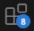
  
* Search for "Python" in the extensions menu, and install the Python extension, which looks like this:

  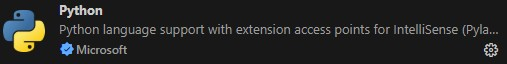
  
* Search for "Jupyter" in the extensions menu, and install the Jupyter extension, which looks like this:

  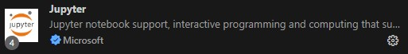


### Download or create a test Python file

If you want to get a feel for what VS Code looks like, it's helpful to have a Python file available that's in the same "style" that we'll be recommending during the workshop, especially for the new-to-Python group.  In particular, we will be using lines that look like this:

`#%%`

To separate "cells" in our code.  A cell is a small block of code (typically 10-50 lines) that does something you can describe in a few words; you often want to make changes to a cell, then re-run the whole cell.  This is something that will be familiar to Matlab users, but is less common in Python code.  VS Code will allow you to execute a cell of code as an atomic action, so this ends up being a very convenient way to break up your code.  Typically you would give a cell a name, like this:

`#%% Load the data file`

Because cells are important to the visual experience you'll have in VS Code, and are important to the way you'll run code, as you get used to VS Code, we recommend having a Python file open with a few cells in it.  We put a file [here](https://raw.githubusercontent.com/cv4ecology/cv4ecology.github.io/refs/heads/main/demo-python-cells.py) that doesn't do anything useful, but has the "look and feel" of the code you'll see during the workshop.  You may want to download that file to a folder on your computer, then open it in VS Code (using file &rarr; open) as you customize and explore VS Code.


### Editing and running Python code

Any time you want to run an entire Python file from VS Code, you can click "run &rarr; debug" or "run &rarr; start without debugging".  But you won't do this very often during this workshop; when working on data science and machine learning code, it's more common to run small bits of code at a time as you build up your Python program.  In VS Code, we will be using the [Python Interactive Window](https://code.visualstudio.com/docs/python/jupyter-support-py) for this.  Think of this window like a live copy of the state of your program, where you can keep running new code and changing variables.  This style of running code will be familiar to Matlab and R users.

Once you've opened your Python file, if you put your cursor in any cell, like this:

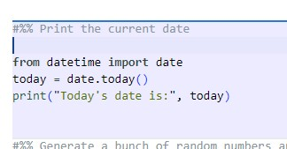

...and press ctrl-enter (or right-click on the editor and click "run in interactive window &rarr; run current cell"), that cell will be executed in the Python Interactive Window, where you'll see the output, like this:

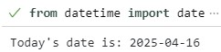

You can also execute one or more lines, instead of a whole cell, by selecting those lines, and pressing shift-enter (or you can right-click on the editor and click "run in interactive window &rarr; run selection/line in interactive window".

For RStudio and Matlab users, this experience should feel familiar, where you have your code in one place and the output in another.  Just like in the Matlab/R Studio console, you can also run code directly in the Python Interactive Window, by clicking in this area in the bottom and typing any code you want to run:

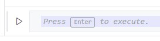

It's generally not recommended to type lots of code directly into that area, since you have no record of that code.  But it's often useful if you just want to run a disposable bit of code, e.g. to print the value or type of a variable.


### VS Code customizations that may make Matlab/R users feel more at home

<b>None of these tweaks are required</b>, I'm just writing this section as a former Matlab user who likes my Python environment to look as Matlab-like as possible.  These recommendations will make the layout more Matlab-like, and will also reduce the visual complexity of the code editor.  These will also be good ways to practice editing VS Code configuration files.

* Choose a color theme you like...

  * You can browse themes at [vscodethemes.com](https://vscodethemes.com).
  * For a Matlab-y theme, I recommend the [Nord Light Brighter](https://vscodethemes.com/e/huytd.nord-light/nord-light-brighter) theme, but to each their own.
  * To install a new theme, click file &rarr; preferences &rarr; themes &rarr; color theme, or press "ctrl-k ctrl-t", then click "browse additional color schemes", and type the name of the theme you want.  Once you have installed a theme, you won't need to click "browse additional color schemes", it will just be there in the list of themes.
  * Click on the theme you want to download, click "OK", and click "Trust Publisher & Install" .

* Make the window layout more Matlab-like:

  * Press ctrl-, (that was control-comma) to open VS Code settings
  * Search for "workbench.panel.defaultlocation"
  * Change "bottom" to "right", like this:
  
    

* Enable Matlab-like bookmarks (in Matlab, you can press ctrl-F2 to mark a line of code, then press F2 to move between marks)

  * Press ctrl-shift-x to bring up the extensions menu (or click the "extensions" icon in the side panel)
  
  * Search for and install the "Bookmarks" extension, which looks like this:
  
    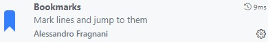
	
  * After installing that extension, the default keyboard shortcuts for this extension are:
  
    * Toggle a bookmark at the current location: ctrl-alt-K
	* Next bookmark: ctrl-alt-L
	* Previous bookmark: ctrl-alt-J
		
* Hide the "minimap", which is the super-fancy scrollbar on the right that smushes all your code into a column:
  
  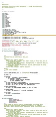
	
  * Click on the minimap, and un-check "minimap"
  * If you want it back, click view &rarr; appearance &rarr; minimap
	
* If you are used to the clean look of code cells in Matlab, you may find this decoration at the top of every cell to be distracting (to each their own, but this former Matlab user can't stand it):
  
  
  
  To disable that decoration:
  
  * Click ctrl-, (that was control-comma) to open settings
  * Search for "jupyter.codelens"
  * Un-check the "enable code lens" checkbox, which looks like this:
  
    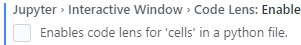
 
  You can still run code cells using the keyboard.


### Editing VS Code settings

There are lots of things you can customize in the VS Code settings menus, but there even <i>more</i> things you can customize by directly editing configuration files.  If you use VS Code for a while, eventually you'll have to edit a settings file somewhere, so, this is as good a time as any to learn how this works.  And as a bonus, VS Code settings files are in [JSON format](https://en.wikipedia.org/wiki/JSON), and lots of data that's relevant to the workshop is also in JSON format, so, this is a good opportunity to understand how JSON files work.  This section is a quick intro to editing the .json settings files; the next section will include some recommended settings.

To edit settings in VS code, first open the settings file:

1. Open VS Code settings by pressing `Ctrl+,` (Windows/Linux) or `Cmd+,` (Mac)
2. Click the "Open Settings (JSON)" icon in the top-right corner (it looks like a page with a curly bracket)
3. This will open the `settings.json` file, which will either be empty or will contain your existing settings

When you add settings, follow these simple rules:

- All settings go inside the main curly braces `{ }`
- Each setting follows this format: `"setting.name": value`
- Values can be text in quotes (`"value"`), numbers without quotes (`42`), or `true`/`false`
- Every setting except the last one must be followed by a comma
- The last setting should not have a comma after it

For example, let's say someone tells you to add this to your settings file (this is one of the changes we'll recommend below:

```json
"editor.lightbulb.enabled": "off"
```

The first time you open your settings file, it will be empty, or it might just be an empty pair of curly braces.  After you add this setting, your settings file should look like this:

```json
{
  "editor.lightbulb.enabled": "off"
}
```

If you already have a bunch of settings in your settings file, for example if you see this:

```json
{
  "editor.fontSize": 14,
  "workbench.colorTheme": "Default Dark+"
}
```

...you can add the new setting at the end, and add a comma after the previous setting, like this:

```json
{
  "editor.fontSize": 14,
  "workbench.colorTheme": "Default Dark+",
  "editor.lightbulb.enabled": "off"
}
```

Notice that:
- Each setting is on its own line
- There's a comma after each setting except the last one
- The whole configuration is wrapped in curly braces `{ }`


### Additional customizations that require editing VS Code settings files

Again, <b>these are all optional tweaks</b> that make a slightly cleaner visual experience that feels a bit more like the Matlab editor.

* Hide this yellow light bulb that appears all over your code:

  

  ...by adding this setting:
  
  `"editor.lightbulb.enabled": "off"`
  
* Hide these vertical bars:

  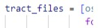
  
  ...by adding this setting:
  
  `"editor.guides.indentation": false`
  
* Disable this highlighting behavior when I put my cursor in any word (but keep it when I select the word):

  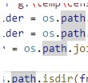
  
  ...by adding this setting:
  
  `"editor.occurrencesHighlight": "off"`
  
* Enable word wrap in the interactive window (so that when you print long lines, they don't run outside the window) by adding this setting:

  `"notebook.output.wordWrap": true`

	
## Installing Miniforge

If you are installing Python for the first time, we recommend installing [Miniforge](https://github.com/conda-forge/miniforge).  Miniforge is an environment for installing and running Python stuff.

### Install Miniforge on Windows

To install Miniforge on Windows, just download and run the [Miniforge installer](https://github.com/conda-forge/miniforge/releases/latest/download/Miniforge3-Windows-x86_64.exe).  If you get a "Windows protected your PC" warning, you might have to click "More info" and "run anyway". You can leave everything at the default value during installation.

All the instructions we provide later in this section will assume you are running at the Miniforge command prompt, which is basically just like a regular command prompt, but it has access to all the Python stuff.  On Windows, once you've installed Miniforge, you can start your Miniforge command prompt by launching the shortcut called "Miniforge prompt".

You will know you are at a Miniforge prompt (as opposed to run-of-the-mill command prompt) if you see an environment name in parentheses before your current directory, like this:

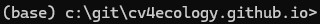

### Install Miniforge on Linux/Mac

The [list of Miniforge installers](https://github.com/conda-forge/miniforge?tab=readme-ov-file#miniforge3) has links for Linux and OSX.  If you're installing on a Mac, be sure to download the right installer: "x86_64" if you are on an Intel Mac, "arm64 (Apple Silicon)" if you are on an M1/M2 Mac with Apple silicon.  In all of these cases, you will be downloading a .sh file; after you run it to install Miniforge, you should see an environment name in parentheses just like in the images above.

### Create a Python virtual environment

Once you've installed Miniforge, open the Miniforge command prompt.  If you are using Windows, you will likely do this using the shortcut called "Miniforge prompt".  If you are on Linux/Mac, you can just start a regular terminal; once you've installed Miniforge, all command prompts are Miniforge command prompts.

As per above, you should see something like this:


Usually when you work with Python code, you create a "virtual environment" for each project.  A Python virtual environment is basically a set of installed libraries, and keeping your projects in different environments make it much easier to handle situations where, for example, one project requires version 1.24.6 of a library, but another project requires version 2.45.99 of the same library.

You can create a Python environment called "ai-workshop" like this:

`conda create -n ai-workshop python=3.11 pip -y`

That tells Miniforge to create a virtual environment called 'ai-workshop', using Python version 3.11, install just the library called "pip" in that environment.  The "-y" at the end says "don't ask me to confirm each step, just create the environment".

Then whenever you want to use that environment, run:

`conda activate ai-workshop`

After that, you should see a prompt that looks like this:

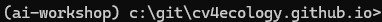

You will need to run the "conda activate" command each time you want to use that environment.

In this workshop, we will use this command prompt to manage and install Python package.  For example, let's install the package called "pandas" in the environment we just created.  Open your Miniforge prompt, activate the environment by running "conda activate ai-workshop", then run:

`pip install pandas`

### Accessing your Python environments in VS Code

VS Code should be aware of Python environments that you create in the Miniforge command prompt, you just need to tell VS Code which environment you want it to use.  In the Python Interactive Window that we referred to earlier, where your output shows up in VS Code, there is an icon in the upper-right that tells you which environment that window is using right now:

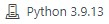

Click that icon, then click "select another kernel", then click "Python environments", and the Python environment you just created should appear there:

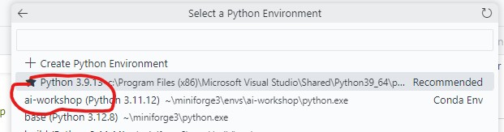

Select that environment.  You may be prompted to install some additional VS Code stuff, click "OK".

We can verify that our environment is working OK by checking that our VS Code window can see the "pandas" library that we installed earlier.  In this area at the bottom of the Python Interactive Window in VS Code:


...run this:

`import pandas; print(pandas.__version__)`

You should see something like this:

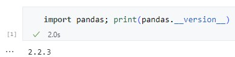


## Remote development

During the workshop, we will be providing storage and compute resources courtesy of the [CyVerse](https://cyverse.org/) program.  Specifically, we have:

1. Some shared storage that we're populating with datasets that participants are likely to access

2. A bunch of Linux computers.  Each of those computers has:
   * A GPU (a small one, but enough to train small deep learning models)
   * A bit of storage for, e.g., model output
   * Access to the larger shared storage

You will usually hear us refer to those computers as "VMs", i.e. "virtual machines".  In fact, for the rest of this section, we will say "VM" rather than "computer".  But VMs are just computers.

VMs are accessible via SSH.  As it becomes necessary to access those computers, we will provide you with login information for a computer that is assigned to you (possibly shared with others with whom you are working).  Broadly speaking, there are two ways you can connect to these VMs: you can connect with an SSH client, and you can connect your VS Code window directly to your remote computer.  During the workshop, you will likely have to do a bit of both.  In this section, we'll document what you should do when you get a brand new VM, and how to connect to it.

### Connecting to your VM with an SSH client

You can connect directly in an SSH client.  As per above, we recommend [PortX](https://portx.online/en/) as a free, cross-platform SSH client, so our instructions will use PortX, but you can use any SSH client you prefer.  Let's say we give you the following login information:  

```
IP address: 1.2.3.4  
login: ai-workshop-participant  
password: ai-workshop-password
```

To use this login information, Start PortX, then click this little button on the left to bring up the connection list:

&nbsp;&nbsp;&nbsp;&nbsp;&nbsp;

Right-click, and click new &rarr; terminal session.  Give it a name, like "AI Workshop VM", and enter the IP address we gave you in the "hostname" box, like this:

&nbsp;&nbsp;&nbsp;&nbsp;&nbsp;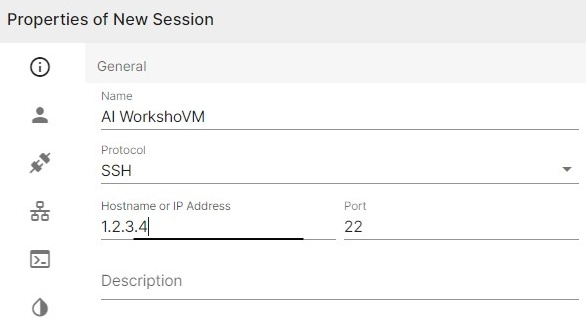

Click the icon on the left that looks like a person, and enter the username and password we gave you:

&nbsp;&nbsp;&nbsp;&nbsp;&nbsp;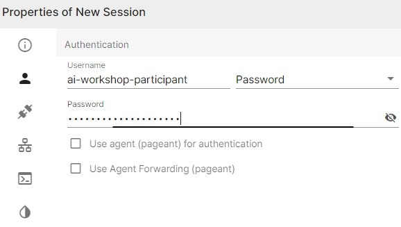

Click "OK", then double-click on the connection you just created.  This will give you a Linux terminal where you can run commands on the remote VM:

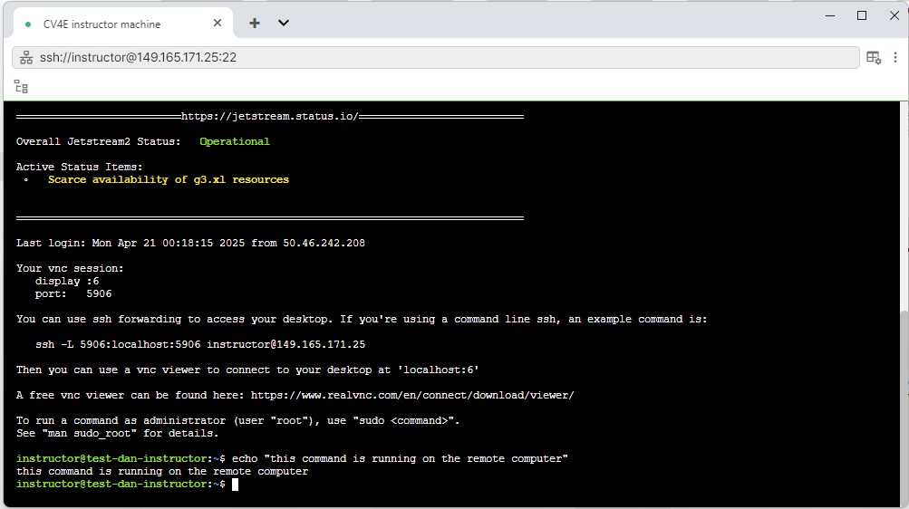

You can also set up a graphical connection over this SSH connection, so you can run graphical programs (especially VS Code) on the remote VM.  We are not going to recommend this as a common approach, but just to have it all documented, here is how you can configure a remote graphical connection:

* Configure port forwarding in your SSH client.  Assuming you are using PortX...<br/><br/>
  * Right-click on the connection you created above
  * Click "properties"
  * Click the icon on the left that looks like the universal symbol for "Internet"
  * Click "Add"
  * Create a rule that looks like this:<br><br>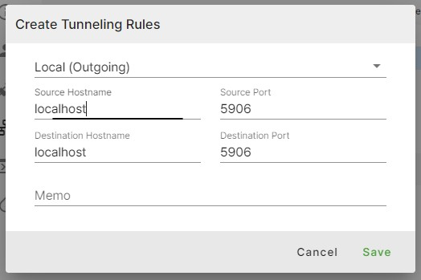
  
* Install a client for the "VNC" graphical desktop protocol.  We recommend the free-and-very-simple "vncviewer64" client that comes with TigerVNC.  If you are a Windows user, go <a href="https://sourceforge.net/projects/tigervnc/files/stable/1.15.0/">here</a> and download "vncviewer64-1.15.0.exe".

* Run the VNCViewer program you just downloaded, and you'll get a window that looks like this:<br/><br/>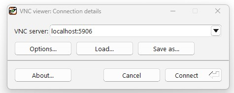<br/><br/>Enter "localhost:5906", like in the screenshot, click "connect", and type your password.  You should get a delightful graphical view of your VM, like this:<br/><br/>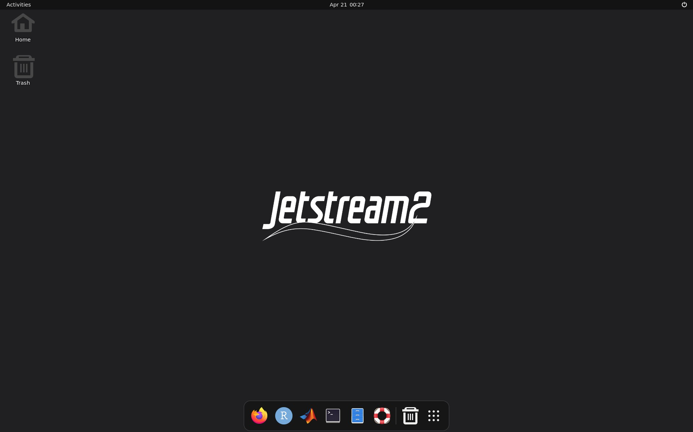

### Installing stuff on your VM

The only thing that you almost definitely want to install on your VM is Miniforge, so you can set up Python environments.  To do that, log in via SSH, and run the following lines (best to just copy and paste directly into the terminal):

```
curl -L -O "https://github.com/conda-forge/miniforge/releases/latest/download/Miniforge3-$(uname)-$(uname -m).sh"
bash Miniforge3-$(uname)-$(uname -m).sh -b
 ~/miniforge3/bin/conda init bash
 source ~/.bashrc
```

As was the case when you installed Miniforge on your local computer, you know everything is working if you see "base" in your command prompt, like this:

&nbsp;&nbsp;&nbsp;&nbsp;&nbsp;

For those who are curious, those four lines do the following things, respectively:

* Download Miniforge, using the [curl](https://curl.se/) program
* Install Miniforge
* Tell Miniforge to change your terminal configuration so it's always available
* Re-read your terminal configuration (technically you could skip this step by logging out and logging in again)

### Connecting to your VM from VS Code

Often you want to use your local VS Code installation, but have the Python code actually be running on the remote VM.  VS Code is very good at this.  To set this up...

* Press ctrl-shift-x to bring up the extensions menu in VS Code, and install the "Remote - SSH" extension, which should look like this:<br/><br/>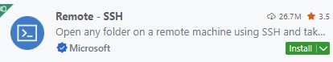
* Click view &rarr; command palette (or press "ctrl-shift-p")
* Type "remote-ssh".  A bunch of different things you can do with this extension will pop up; click the one that says "remote-ssh: connect to host".  You should see this:<br/><br/>
* Click "add new ssh host"
* In the box that comes up, type "ssh [user]@[ip-address]".  Using the example from above, you would type:<br/>ai-workshop-participant@1.2.3.4
* A little message will pop up saying that the new connection was created.
* Launch the "remote-ssh: connect to host" command again, this time your connection will be in the list, before "add new ssh host".  Click on the new connection.
* A new window will pop up, in which you will be prompted for the operating system type of the remote computer, click "Linux":<br/>
* Click "continue".  You will be prompted for your password, type it.
* You'll see a brand new VS Code Window pop up.  This VS Code window is connected to the remote VM.  For example, if you create a new file and click "save", you'll see that the default folder is your home folder on the remote Linux VM, not the default "save" folder on your local PC
* Install the "Python" and "Jupyter" extensions in this Window, just like you did on your own computer.