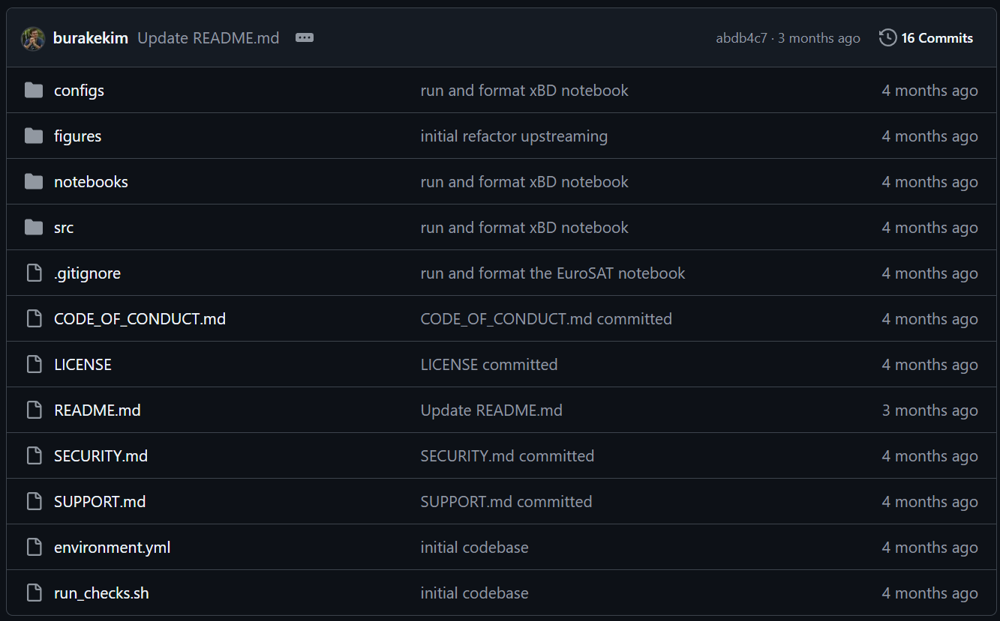
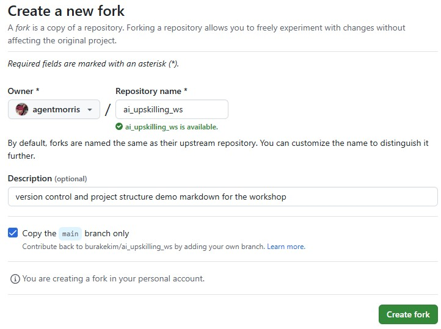
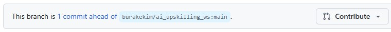

## 1. Version control: cool, but why?

**Git** is a tool that tracks changes to your code over time — like a timeline or save history for your project.

**GitHub** is a website that hosts Git repositories online so you can share your code and collaborate with others.

Why use them?

- Track changes as you work.
- Revert mistakes easily.
- Work with others without overwriting each other’s code.
- Keep your local and online versions in sync.

You don't have to use GitHub to store your code during this workshop, but you might want to: GitHub is a great way to keep your code safe, to synchronize your code between your local computer and the remote computer where you will train models, and to share code with other participants.


## 2. What’s inside a typical GitHub repo?

GitHub repos are just folders; in theory, you can organize files however you like within them. However, knowing about some common files and folders will help you more quickly understand other repos, and will help you create repos that are more easily reusable.

Here are some files you’ll usually see in a GitHub repo (and why it helps):

- `README.md` — The main documentation you see when you visit a GitHub repo in your browser; it typically describes what the project does, how to run it, etc.  This file is always in [markdown format](https://www.markdownguide.org/basic-syntax/).
- `LICENSE` — Describes the license applied to the contents of this repo.  The [MIT license](https://opensource.org/license/mit) is a safe default for open-source code.
- `.gitignore` — Tells Git what *not* to track (typically stuff your local computer might create temporarily in your copy of a repo, e.g. `.DS_Store`, `.ipynb_checkpoints`, `env/`).

If the repo hosts Python code, you'll almost always see one of the following:

- `environment.yml`, `pyproject.toml`, or `requirements.txt` — Lists the Python packages needed to run your code.

The following are common for repos related to AI:

- `notebooks/` — Jupyter notebooks for exploration, training, or demos.
- `src/` or `project_name/` — Your actual Python code, scripts, modules.
- `data/` — (If included) Sample or small data files. Bigger data = handled outside GitHub.
- `tests/` — Optional, but great for checking if your code still works after changes.
- `.github/` — Optional automation/configs for GitHub (like workflows or templates).

No need to use all of these — start simple, but know what’s out there. 

A sample (but not so simple) repo might look like: 




## 3. GitHub: just tell me what I need to know

You’ll hear a lot of terms like "clone", "commit", "pull request", "fork", etc. Here’s what each of these terms means — and why we use them.

### Repository (aka "repo")

A project folder tracked by Git. This is where all your code and history lives.

### Clone

A Git command that **copies a repo from GitHub to your local machine**, so you can work on it.  
_Why?_ You can’t edit a GitHub repo directly from your laptop — you need a local copy.

### Commit

A Git command that **saves a snapshot of your changes** with a short message.  
_Why?_ Commits let you track what changed, when, and why — and you can always roll back if needed.

### Push

A Git command that **uploads your local commits**.  
_Why?_ This keeps your online repo up to date — and shareable with others.

### Pull

A Git command that **brings down new changes from GitHub to your machine**.  
_Why?_ If someone else made updates, you need to sync before continuing.

### Branch

A Git command that **creates a separate line of work** without affecting the main code.  
_Why?_ It’s safer to experiment or add features in a branch before merging.

### Pull Request (PR)

A **request to merge your branch into the main project** — and others can review it first.  
_Why?_ Although you *can* just push code directly to the main code branch on your repo (often that's convenient for one-person, experimental projects), PRs keep the main code clean and stable. They also make collaboration easier.

### Fork

A mechanism offered by GitHub to **make your own copy of someone else’s repo** (on GitHub, not your machine).
_Why?_ You can propose changes to someone else’s project, even without direct access.

The term "fork" refers to both the act of making a copy (e.g., "I am going to fork Jane's repo") and the copy itself (e.g., "this is my fork of Jane's repo").

### That was a lot...

You don’t need to memorize all this now — we’ll walk through each step live. But it helps to know *why* we do these things before we do them.

Also, although 99% of the Git you will encounter is probably on GitHub, it's useful to note that GitHub is just one place where git repos can be hosted.  All of the above concepts are core Git concepts <i>except</i> for "pull requests" and "forks"; those are GitHub concepts.


## 4. Trying it all out

So now that you kinda know what Git and GitHub are... Let’s actually use them.

🛠️ **This is the hands-on part. Please follow along if you can.**

We’re going to:

- Set up your tools (Git, GitHub, VS Code)
- Create your first GitHub repository
- Clone it to your machine
- Make a change and push it back
- Learn how to use branches and pull requests
- Try contributing to someone else’s repo using forks
- (Bonus!) Simulate and fix a merge conflict

This sounds like a lot — but we’ll walk through it step by step, and you’ll be surprised how smooth it is once you get going.

Let’s start by getting your machine ready.

### Install Git

Check whether Git is already installed:

```bash
git --version
```

If you see a version number, you're good.

If not:

- **Windows**: Install [Git for Windows](https://git-scm.com/download/win).
- **Mac**: Run `git` in Terminal; it may prompt you to install Xcode tools.
- **Linux**: Use your package manager (`sudo apt install git`)

After installing Git, configure Git with your name and email by running the following in a console window:

```bash 
git config --global user.name "Your Name"  
git config --global user.email "you@example.com"
```

### Create a GitHub account

If you don’t have one, go to [github.com](https://github.com/) and sign up.  Pick a username, verify your email, and you’re in.

### Set up VS Code

Download and install [Visual Studio Code](https://code.visualstudio.com/). It’s lightweight, powerful, and works great with Git and Python.

Then:

1. Open VS Code.
2. Go to the Extensions tab (left sidebar).
3. Install:
   - **Python** (by Microsoft)
   - **GitHub Pull Requests and Issues** (optional)
   - **GitLens** (optional, for better Git history views)

Make sure Git works inside VS Code:

- Open the terminal inside VS Code.
- Run `git --version`.

If you see a version number, you're good to go.


## 5. Create and clone a repo

### Create a new repo on GitHub

1. Go to [github.com](https://github.com).
2. Click the **+** in the top right → **New repository**.
3. Give it a name (e.g., `my-first-repo`).
4. Check **"Add a README file"**.
5. Click **Create repository**.

Now you have a repo! Let’s bring it to your machine.

### Clone the repo locally

You are about to clone (i.e., copy) the repository you just created to your current folder, so you may want to change your console's current directory into a folder on your computer where you want to keep workshop stuff.  For example, before cloning the repo, you may want to run:

```bash
mkdir c:\ai-workshop
cd c:\ai-workshop
```

When you console is in the folder where you want to copy the repo, run the following to clone the repo:

```bash
git clone https://github.com/your-username/my-first-repo.git  
cd my-first-repo
```

This creates a folder on your machine with all the files from the GitHub repo. You're ready to start working!

## 6. Make, commit, and push a change

### Edit a file

Open the `README.md` file in VS Code. Change or add a line — anything simple.

### Stage and commit

Check what changed:

```bash
git status
```

Stage the file... staging is probably the most confusing thing about a typical Git workflow.  The `git add` command tells git that you are "staging" some changes before "committing" them.  There is not really a good reason why these are two separate steps in 99% of cases; any time you run `git add`, you are almost definitely about to run `git commit`.

```bash
git add README.md
```

Commit it with a message:

```bash
git commit -m "Update README"
```

### Push to GitHub

```bash
git push
```

Go to your repo on GitHub — you’ll see your change there.

## 7. Branching and pull requests

### Create a branch

```bash
git checkout -b my-feature
```

This creates a new branch and switches to it.

### Make changes and push

Edit a file again, then:

```bash
git add -A
git commit -m "Edit on my-feature branch"  
git push -u origin my-feature
```

This time, just to show a slightly different approach, we used `git add -A` rather than adding a specific file: this says "I'm going to upload <i>all</i> files with changes".  This is very common when you are editing lots of files: if you edit code in 10 different files, it's a pain to `git add` them individually.  But... always run `git status` to check which files have changes before using `git add -A`!  You can easily commit changes you don't mean to commit - like adding random files to your repo - if you use `git add -A` without looking at the output of `git status`.

### Open and merge a pull request

1. Go to your repo on GitHub.
2. You’ll see a **"Compare & pull request"** button. Click it.
3. Add a short description and click **"Create pull request"**.
4. Click **"Merge pull request"**, then **"Confirm"**.

Done! Your change is now in `main`.

## 8. Forking and upstream PRs

In this section, we're going to talk about how you can request changes to <i>someone else's</i> repo; this is a core part of how open-source software works.  Anyone can suggest a change — or, in GitHub terms, "open a pull request" — to anyone else's repo.   As you go through this exercise, though, you probably want to pick a repo where it's socially OK to suggest random changes, and where the repo owner is likely to merge your random changes, so, for this part of the exercise, we recommend finding a friend in the workshop with whom you can exchange PRs.  It's fine if many people are making PRs to the same repo.

In this document, we’ll assume your GitHub username is `awesome-elephant` and that you’re friends with a GitHub user named `fantastic-lion`. You’ll be requesting changes to one of their repos called `wonderful-project`, which would typically be at:

https://github.com/fantastic-lion/wonderful-project

### Fork a repo on GitHub

Go to a repo you want to contribute to (in our example, the "wonderful-project" repo), and click **Fork** in the top right:

&nbsp;&nbsp;&nbsp;&nbsp;&nbsp;

GitHub will ask you for a name for the new repo:

&nbsp;&nbsp;&nbsp;&nbsp;&nbsp;

 99% of the time, you want to keep the original name (i.e., you want to leave the "Create a new fork" page at its default settings).  This isn't required, but it's a convenient convention.  Click "create fork".  

This creates a copy under your account, so in our example, where you are `awesome-elephant`, you just created a repo at:

&nbsp;&nbsp;&nbsp;&nbsp;&nbsp;https://github.com/awesome-elephant/wonderful-project
  
At this point, the fork is still on GitHub, you haven't copied it to your local computer.  

### Clone your fork

```bash
git clone https://github.com/awesome-elephant/wonderful-project
cd wonderful-project
```

### Push changes and submit a PR to the original repo

* Make a change (any change).

* Push it back to your fork:

```bash
git add README.md  
git commit -m "Fix typo in README"  
git push
```

At this point, you have made a change to your fork on GitHub.  You didn't need any permission from the original repo owner to do this.  Sometimes you want to make a small change to an open-source project just for your own use case, and you never want to push it back to the original repo (aka the "upstream fork").  For that scenario, you're done.  But let's explore the case where you want to contribute your change back to the original repo.

* Visit your fork on GitHub.  Near the top of the page, you should see something like this, telling you that you've made a change that you can contribute back to the original repo:

&nbsp;&nbsp;&nbsp;&nbsp;&nbsp;

* Click contribute &rarr; open pull request.  Your commit message should be the default title.  In a real scenario, you would typically add a description explaining your proposed changes in more detail.  When you're ready, click "create pull request".  

Now you have a request pending in someone else's project.  They will probably get a notification, although during the workshop, you might just want to send your friend (in our example, `fantastic-lion`) a message asking them approve or reject your PR.  Popular repositories often have hundreds of pending PRs; for example, the [ultralytics](https://github.com/ultralytics/ultralytics) repository hosts tools many folks will be using during this workshop, and as of the time we're creating this documentation, their ["open issues" list](https://github.com/ultralytics/ultralytics/pulls) has 250 open PRs.  Many of those will eventually get accepted (aka "merged"), many will get rejected, many will sit on that queue forever.


## 10. Merge conflicts (bonus)

Sometimes two people edit the same part of a file. Git doesn’t know which version to keep — that’s a conflict. Here’s how to simulate and fix one.

### Simulate a conflict

1. Make sure your repo is up to date:

```bash
git checkout main  
git pull
```

2. Create a new branch and edit the README:

```bash
git checkout -b branch-one
```

Edit a line in `README.md`, save it, then:

```bash
git add README.md  
git commit -m "Edit from branch-one"  
git push -u origin branch-one
```

3. Switch back to `main` and create another branch:

```bash
git checkout main  
git checkout -b branch-two
```

Edit the **same line** in `README.md`, save, then:

```bash
git add README.md  
git commit -m "Edit from branch-two"
```

Now try to merge `branch-one` into `branch-two`:

```bash
git merge branch-one
```

You’ll see a **conflict warning**.

### Resolve the conflict locally

Open the file — Git will show conflict markers like this:

```text
<<<<<<< HEAD
Edit from branch-two
=======
Edit from branch-one
>>>>>>> branch-one
```
Edit the file to keep what you want, remove the markers, then:

```bash
git add README.md
git commit -m "Resolve conflict"
```

Done. The conflict is fixed, and the merge is complete. Merge conflicts are normal — don’t panic. Just read the file, choose what to keep, and commit.


## 11. Best practices

### ✅ Keep commits small and clear

Make one or few logical change(s) per commit (e.g., "add new function" or "fix typo"). Avoid dumping unrelated edits into a single commit.

### ✅ Write meaningful commit messages

Use short but clear messages like:
- `fix image path bug`
- `loss function refactor for multiclass`
- `update README with bibtex`

Better to avoid generic ones like `update` or `stuff`.

### ❌ Don't upload (bulky) data or secrets

Large datasets, credentials, API keys — don’t add them to GitHub. You can use shared drives or cloud buckets instead.

### ✅ Use `.gitignore`

Avoid committing unnecessary or generated files:

- Add `.ipynb_checkpoints/`, `__pycache__/`, `*.csv`, `*.h5`, etc.
- Keep repos clean and fast to clone.

### ✅ Push often

Push your changes regularly — don’t sit on lots of uncommitted work.

### ✅ Stay organized

Group related files into folders (`notebooks/`, `src/`, etc.), and name things clearly. Others (and especially  _future you_) will thank you.

## 🎉 That’s it!

If you’ve followed along this far — or even if you just scrolled your way here — **congrats**! You’ve just walked through the core of how version control things are done in the real world. Please keep using these tools during the workshop — and beyond. You have got this \o/


## 12. Keep going: level up your GitHub game

GitHub isn’t just a place to push code — it’s part of a broader ecosystem of **open-source practices** and **tools for writing better software**.

If you're curious or excited to go further, here are some areas you might explore next:

### Tools

These help make your code more readable, testable, and production-ready.

- **What are all those badges in repos?**  
  [Shields.io](https://shields.io/) — Build, test, license, and other status badges.

- **Intro to GitHub Actions (CI/CD)**  
  [GitHub Actions Docs](https://docs.github.com/en/actions) — Automate tests, builds, or anything else when someone pushes code.

- **What is linting? Why does it matter?**  
  [Introduction to Python Linting](https://realpython.com/python-pep8/) — Keep your code clean and consistent.

- **Writing Tests**  
  [pytest Intro](https://docs.pytest.org/en/stable/getting-started.html)

- **Publishing to PyPI**  
  [Packaging Python Projects](https://packaging.python.org/en/latest/tutorials/packaging-projects/) — Share your code as an installable package.

### Open source and open science culture  

These make your work more transparent, reusable, and community-friendly.

- **Why license your code?**  
  - [Choose a License](https://choosealicense.com/) — Quick guide to picking the right license.
  - [Ethical Software Licenses](https://ethicalsource.dev/licenses/) — An initiative for ethical licenses.

- **Make your research reproducible**  
  [The Turing Way – Guide to Reproducible Research](https://the-turing-way.netlify.app/reproducible-research/reproducible-research.html)

- **Write better, reusable OSS code**  
  [GitHub’s Open Source Guides](https://opensource.guide/) — Community standards, maintenance tips, etc.

- **Find open projects to contribute to**  
  - [WILDLABS OSS Forum](https://www.wildlabs.net/community/thread/oss)  
  - [Work On Climate](https://www.workonclimate.org/)  
  - [Good First Issue](https://goodfirstissue.dev/) — Find beginner-friendly issues on GitHub.